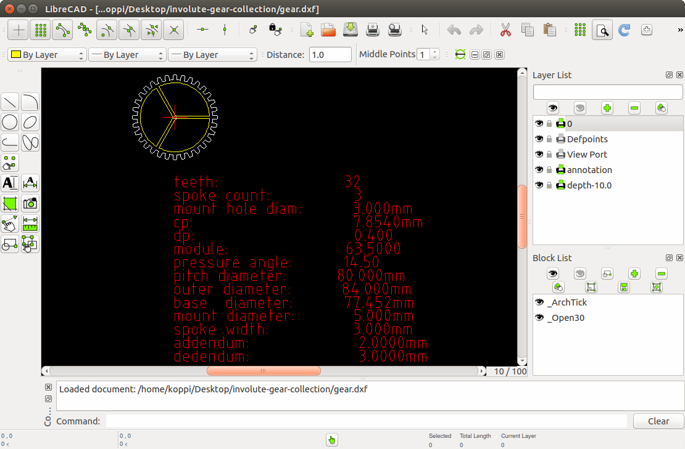
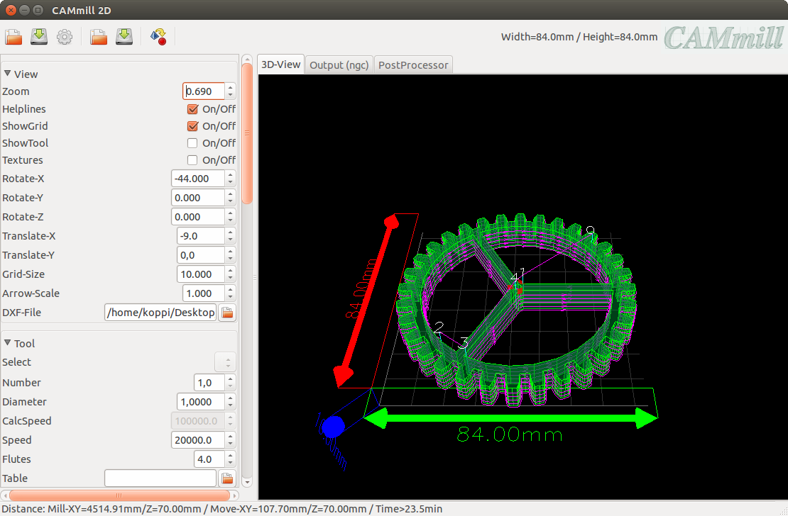

This collection contains dxf and stl files of involute gears

* [pressure angle 14.5°](angle-14.5):
  
  
* [pressure angle 20°](angle-20):
  

## HOWTO create your own involute gear collection

### download and prepare programs and libraries

```bash
$ sudo npm install -g involute-gear-generator
$ sudo apt-get -y install git python-pip
$ git clone https://github.com/koppi/involute-gear-collection
$ pip install ezdxf dxfgrabber
```

### librecad
```bash
$ librecad gear.dxf
```

### cammill
```bash
$ cammill gear.dxf
```


## HOWTO update the collection

Install OpenSCAD and ImageMagick:
```bash
$ sudo apt-get -y install imagemagick openscad
```

Adjust [bin/create-involute-gear-collection.sh](bin/create-involute-gear-collection.sh) and rerun [update.sh](update.sh):

```bash
$ editor bin/create-involute-gear-collection.sh
$ ./update.sh
```

## Credits

* https://github.com/jnweiger/inkscape-gears-dev
