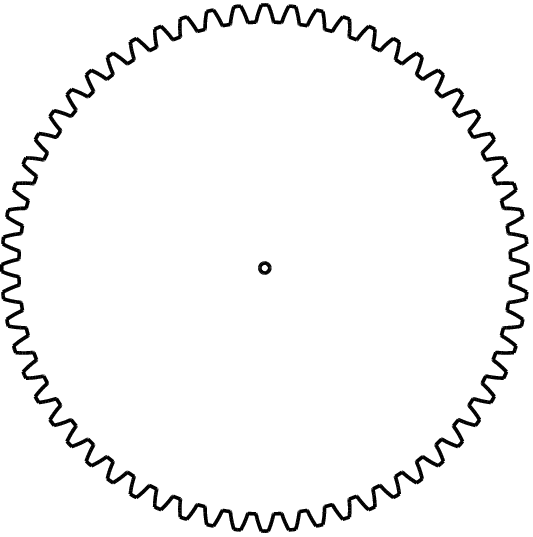

# angle-20/

info = [ { gear1: 
     [ { toothWidth: 4 },
       { addendum: 2.5464790894703255 },
       { shiftedAddendum: 2.5464790894703255 },
       { clearance: 0.05 },
       { cutterDepth: 2.5964790894703254 },
       { cutterOutsideLength: 7.639437268410976 },
       { backlash: 0.05 },
       { dx: 0.026604444311897804 },
       [length]: 8 ] },
  [length]: 1 ]
input size:  16x17
output size: 215x224
items: 124

 [DXF](teeth-05.dxf) [STL](teeth-05.stl)

 [DXF](teeth-05-multiple.dxf) [STL](teeth-05-multiple.stl)

info = [ { gear1: 
     [ { toothWidth: 4 },
       { addendum: 2.5464790894703255 },
       { shiftedAddendum: 2.5464790894703255 },
       { clearance: 0.05 },
       { cutterDepth: 2.5964790894703254 },
       { cutterOutsideLength: 7.639437268410976 },
       { backlash: 0.05 },
       { dx: 0.026604444311897804 },
       [length]: 8 ] },
  [length]: 1 ]
input size:  20x18
output size: 202x237
items: 98

 [DXF](teeth-06.dxf) [STL](teeth-06.stl)

 [DXF](teeth-06-multiple.dxf) [STL](teeth-06-multiple.stl)

info = [ { gear1: 
     [ { toothWidth: 4 },
       { addendum: 2.5464790894703255 },
       { shiftedAddendum: 2.5464790894703255 },
       { clearance: 0.05 },
       { cutterDepth: 2.5964790894703254 },
       { cutterOutsideLength: 7.639437268410976 },
       { backlash: 0.05 },
       { dx: 0.026604444311897804 },
       [length]: 8 ] },
  [length]: 1 ]
input size:  22x22
output size: 216x225
items: 75

 [DXF](teeth-07.dxf) [STL](teeth-07.stl)

 [DXF](teeth-07-multiple.dxf) [STL](teeth-07-multiple.stl)

info = [ { gear1: 
     [ { toothWidth: 4 },
       { addendum: 2.5464790894703255 },
       { shiftedAddendum: 2.5464790894703255 },
       { clearance: 0.05 },
       { cutterDepth: 2.5964790894703254 },
       { cutterOutsideLength: 7.639437268410976 },
       { backlash: 0.05 },
       { dx: 0.026604444311897804 },
       [length]: 8 ] },
  [length]: 1 ]
input size:  25x25
output size: 213x229
items: 59

 [DXF](teeth-08.dxf) [STL](teeth-08.stl)

 [DXF](teeth-08-multiple.dxf) [STL](teeth-08-multiple.stl)

info = [ { gear1: 
     [ { toothWidth: 4 },
       { addendum: 2.5464790894703255 },
       { shiftedAddendum: 2.5464790894703255 },
       { clearance: 0.05 },
       { cutterDepth: 2.5964790894703254 },
       { cutterOutsideLength: 7.639437268410976 },
       { backlash: 0.05 },
       { dx: 0.026604444311897804 },
       [length]: 8 ] },
  [length]: 1 ]
input size:  27x27
output size: 194x221
items: 44

 [DXF](teeth-09.dxf) [STL](teeth-09.stl)

 [DXF](teeth-09-multiple.dxf) [STL](teeth-09-multiple.stl)

info = [ { gear1: 
     [ { toothWidth: 4 },
       { addendum: 2.5464790894703255 },
       { shiftedAddendum: 2.5464790894703255 },
       { clearance: 0.05 },
       { cutterDepth: 2.5964790894703254 },
       { cutterOutsideLength: 7.639437268410976 },
       { backlash: 0.05 },
       { dx: 0.026604444311897804 },
       [length]: 8 ] },
  [length]: 1 ]
input size:  30x29
output size: 213x235
items: 44

 [DXF](teeth-10.dxf) [STL](teeth-10.stl)

 [DXF](teeth-10-multiple.dxf) [STL](teeth-10-multiple.stl)

info = [ { gear1: 
     [ { toothWidth: 4 },
       { addendum: 2.5464790894703255 },
       { shiftedAddendum: 2.5464790894703255 },
       { clearance: 0.05 },
       { cutterDepth: 2.5964790894703254 },
       { cutterOutsideLength: 7.639437268410976 },
       { backlash: 0.05 },
       { dx: 0.026604444311897804 },
       [length]: 8 ] },
  [length]: 1 ]
input size:  32x32
output size: 187x229
items: 32

 [DXF](teeth-11.dxf) [STL](teeth-11.stl)

 [DXF](teeth-11-multiple.dxf) [STL](teeth-11-multiple.stl)

info = [ { gear1: 
     [ { toothWidth: 4 },
       { addendum: 2.5464790894703255 },
       { shiftedAddendum: 2.5464790894703255 },
       { clearance: 0.05 },
       { cutterDepth: 2.5964790894703254 },
       { cutterOutsideLength: 7.639437268410976 },
       { backlash: 0.05 },
       { dx: 0.026604444311897804 },
       [length]: 8 ] },
  [length]: 1 ]
input size:  35x35
output size: 203x213
items: 27

 [DXF](teeth-12.dxf) [STL](teeth-12.stl)

 [DXF](teeth-12-multiple.dxf) [STL](teeth-12-multiple.stl)

info = [ { gear1: 
     [ { toothWidth: 4 },
       { addendum: 2.5464790894703255 },
       { shiftedAddendum: 2.5464790894703255 },
       { clearance: 0.05 },
       { cutterDepth: 2.5964790894703254 },
       { cutterOutsideLength: 7.639437268410976 },
       { backlash: 0.05 },
       { dx: 0.026604444311897804 },
       [length]: 8 ] },
  [length]: 1 ]
input size:  37x37
output size: 213x227
items: 27

 [DXF](teeth-13.dxf) [STL](teeth-13.stl)

 [DXF](teeth-13-multiple.dxf) [STL](teeth-13-multiple.stl)

info = [ { gear1: 
     [ { toothWidth: 4 },
       { addendum: 2.5464790894703255 },
       { shiftedAddendum: 2.5464790894703255 },
       { clearance: 0.05 },
       { cutterDepth: 2.5964790894703254 },
       { cutterOutsideLength: 7.639437268410976 },
       { backlash: 0.05 },
       { dx: 0.026604444311897804 },
       [length]: 8 ] },
  [length]: 1 ]
input size:  40x39
output size: 182x239
items: 21

 [DXF](teeth-14.dxf) [STL](teeth-14.stl)

 [DXF](teeth-14-multiple.dxf) [STL](teeth-14-multiple.stl)

info = [ { gear1: 
     [ { toothWidth: 4 },
       { addendum: 2.5464790894703255 },
       { shiftedAddendum: 2.5464790894703255 },
       { clearance: 0.05 },
       { cutterDepth: 2.5964790894703254 },
       { cutterOutsideLength: 7.639437268410976 },
       { backlash: 0.05 },
       { dx: 0.026604444311897804 },
       [length]: 8 ] },
  [length]: 1 ]
input size:  42x43
output size: 191x215
items: 18

 [DXF](teeth-15.dxf) [STL](teeth-15.stl)

 [DXF](teeth-15-multiple.dxf) [STL](teeth-15-multiple.stl)

info = [ { gear1: 
     [ { toothWidth: 4 },
       { addendum: 2.5464790894703255 },
       { shiftedAddendum: 2.5464790894703255 },
       { clearance: 0.05 },
       { cutterDepth: 2.5964790894703254 },
       { cutterOutsideLength: 7.639437268410976 },
       { backlash: 0.05 },
       { dx: 0.026604444311897804 },
       [length]: 8 ] },
  [length]: 1 ]
input size:  45x45
output size: 203x229
items: 18

 [DXF](teeth-16.dxf) [STL](teeth-16.stl)

 [DXF](teeth-16-multiple.dxf) [STL](teeth-16-multiple.stl)

info = [ { gear1: 
     [ { toothWidth: 4 },
       { addendum: 2.5464790894703255 },
       { shiftedAddendum: 2.5464790894703255 },
       { clearance: 0.05 },
       { cutterDepth: 2.5964790894703254 },
       { cutterOutsideLength: 7.639437268410976 },
       { backlash: 0.05 },
       { dx: 0.026604444311897804 },
       [length]: 8 ] },
  [length]: 1 ]
input size:  48x48
output size: 212x192
items: 14

 [DXF](teeth-17.dxf) [STL](teeth-17.stl)

 [DXF](teeth-17-multiple.dxf) [STL](teeth-17-multiple.stl)

info = [ { gear1: 
     [ { toothWidth: 4 },
       { addendum: 2.5464790894703255 },
       { shiftedAddendum: 2.5464790894703255 },
       { clearance: 0.05 },
       { cutterDepth: 2.5964790894703254 },
       { cutterOutsideLength: 7.639437268410976 },
       { backlash: 0.05 },
       { dx: 0.026604444311897804 },
       [length]: 8 ] },
  [length]: 1 ]
input size:  50x50
output size: 167x201
items: 10

 [DXF](teeth-18.dxf) [STL](teeth-18.stl)

 [DXF](teeth-18-multiple.dxf) [STL](teeth-18-multiple.stl)

info = [ { gear1: 
     [ { toothWidth: 4 },
       { addendum: 2.5464790894703255 },
       { shiftedAddendum: 2.5464790894703255 },
       { clearance: 0.05 },
       { cutterDepth: 2.5964790894703254 },
       { cutterOutsideLength: 7.639437268410976 },
       { backlash: 0.05 },
       { dx: 0.026604444311897804 },
       [length]: 8 ] },
  [length]: 1 ]
input size:  53x53
output size: 174x213
items: 10

 [DXF](teeth-19.dxf) [STL](teeth-19.stl)

 [DXF](teeth-19-multiple.dxf) [STL](teeth-19-multiple.stl)

info = [ { gear1: 
     [ { toothWidth: 4 },
       { addendum: 2.5464790894703255 },
       { shiftedAddendum: 2.5464790894703255 },
       { clearance: 0.05 },
       { cutterDepth: 2.5964790894703254 },
       { cutterOutsideLength: 7.639437268410976 },
       { backlash: 0.05 },
       { dx: 0.026604444311897804 },
       [length]: 8 ] },
  [length]: 1 ]
input size:  56x56
output size: 183x224
items: 10

 [DXF](teeth-20.dxf) [STL](teeth-20.stl)

 [DXF](teeth-20-multiple.dxf) [STL](teeth-20-multiple.stl)

info = [ { gear1: 
     [ { toothWidth: 4 },
       { addendum: 2.5464790894703255 },
       { shiftedAddendum: 2.5464790894703255 },
       { clearance: 0.05 },
       { cutterDepth: 2.5964790894703254 },
       { cutterOutsideLength: 7.639437268410976 },
       { backlash: 0.05 },
       { dx: 0.026604444311897804 },
       [length]: 8 ] },
  [length]: 1 ]
input size:  58x58
output size: 189x233
items: 10

 [DXF](teeth-21.dxf) [STL](teeth-21.stl)

 [DXF](teeth-21-multiple.dxf) [STL](teeth-21-multiple.stl)

info = [ { gear1: 
     [ { toothWidth: 4 },
       { addendum: 2.5464790894703255 },
       { shiftedAddendum: 2.5464790894703255 },
       { clearance: 0.05 },
       { cutterDepth: 2.5964790894703254 },
       { cutterOutsideLength: 7.639437268410976 },
       { backlash: 0.05 },
       { dx: 0.026604444311897804 },
       [length]: 8 ] },
  [length]: 1 ]
input size:  61x60
output size: 198x181
items: 8

 [DXF](teeth-22.dxf) [STL](teeth-22.stl)

 [DXF](teeth-22-multiple.dxf) [STL](teeth-22-multiple.stl)

info = [ { gear1: 
     [ { toothWidth: 4 },
       { addendum: 2.5464790894703255 },
       { shiftedAddendum: 2.5464790894703255 },
       { clearance: 0.05 },
       { cutterDepth: 2.5964790894703254 },
       { cutterOutsideLength: 7.639437268410976 },
       { backlash: 0.05 },
       { dx: 0.026604444311897804 },
       [length]: 8 ] },
  [length]: 1 ]
input size:  63x63
output size: 205x190
items: 8

 [DXF](teeth-23.dxf) [STL](teeth-23.stl)

 [DXF](teeth-23-multiple.dxf) [STL](teeth-23-multiple.stl)

info = [ { gear1: 
     [ { toothWidth: 4 },
       { addendum: 2.5464790894703255 },
       { shiftedAddendum: 2.5464790894703255 },
       { clearance: 0.05 },
       { cutterDepth: 2.5964790894703254 },
       { cutterOutsideLength: 7.639437268410976 },
       { backlash: 0.05 },
       { dx: 0.026604444311897804 },
       [length]: 8 ] },
  [length]: 1 ]
input size:  66x66
output size: 213x198
items: 8

 [DXF](teeth-24.dxf) [STL](teeth-24.stl)

 [DXF](teeth-24-multiple.dxf) [STL](teeth-24-multiple.stl)

info = [ { gear1: 
     [ { toothWidth: 4 },
       { addendum: 2.5464790894703255 },
       { shiftedAddendum: 2.5464790894703255 },
       { clearance: 0.05 },
       { cutterDepth: 2.5964790894703254 },
       { cutterOutsideLength: 7.639437268410976 },
       { backlash: 0.05 },
       { dx: 0.026604444311897804 },
       [length]: 8 ] },
  [length]: 1 ]
input size:  68x68
output size: 147x205
items: 5

 [DXF](teeth-25.dxf) [STL](teeth-25.stl)

 [DXF](teeth-25-multiple.dxf) [STL](teeth-25-multiple.stl)

info = [ { gear1: 
     [ { toothWidth: 4 },
       { addendum: 2.5464790894703255 },
       { shiftedAddendum: 2.5464790894703255 },
       { clearance: 0.05 },
       { cutterDepth: 2.5964790894703254 },
       { cutterOutsideLength: 7.639437268410976 },
       { backlash: 0.05 },
       { dx: 0.026604444311897804 },
       [length]: 8 ] },
  [length]: 1 ]
input size:  71x70
output size: 152x212
items: 5

 [DXF](teeth-26.dxf) [STL](teeth-26.stl)

 [DXF](teeth-26-multiple.dxf) [STL](teeth-26-multiple.stl)

info = [ { gear1: 
     [ { toothWidth: 4 },
       { addendum: 2.5464790894703255 },
       { shiftedAddendum: 2.5464790894703255 },
       { clearance: 0.05 },
       { cutterDepth: 2.5964790894703254 },
       { cutterOutsideLength: 7.639437268410976 },
       { backlash: 0.05 },
       { dx: 0.026604444311897804 },
       [length]: 8 ] },
  [length]: 1 ]
input size:  73x73
output size: 157x221
items: 5

 [DXF](teeth-27.dxf) [STL](teeth-27.stl)

 [DXF](teeth-27-multiple.dxf) [STL](teeth-27-multiple.stl)

info = [ { gear1: 
     [ { toothWidth: 4 },
       { addendum: 2.5464790894703255 },
       { shiftedAddendum: 2.5464790894703255 },
       { clearance: 0.05 },
       { cutterDepth: 2.5964790894703254 },
       { cutterOutsideLength: 7.639437268410976 },
       { backlash: 0.05 },
       { dx: 0.026604444311897804 },
       [length]: 8 ] },
  [length]: 1 ]
input size:  76x76
output size: 162x229
items: 5

 [DXF](teeth-28.dxf) [STL](teeth-28.stl)

 [DXF](teeth-28-multiple.dxf) [STL](teeth-28-multiple.stl)

info = [ { gear1: 
     [ { toothWidth: 4 },
       { addendum: 2.5464790894703255 },
       { shiftedAddendum: 2.5464790894703255 },
       { clearance: 0.05 },
       { cutterDepth: 2.5964790894703254 },
       { cutterOutsideLength: 7.639437268410976 },
       { backlash: 0.05 },
       { dx: 0.026604444311897804 },
       [length]: 8 ] },
  [length]: 1 ]
input size:  78x78
output size: 167x236
items: 5

 [DXF](teeth-29.dxf) [STL](teeth-29.stl)

 [DXF](teeth-29-multiple.dxf) [STL](teeth-29-multiple.stl)

info = [ { gear1: 
     [ { toothWidth: 4 },
       { addendum: 2.5464790894703255 },
       { shiftedAddendum: 2.5464790894703255 },
       { clearance: 0.05 },
       { cutterDepth: 2.5964790894703254 },
       { cutterOutsideLength: 7.639437268410976 },
       { backlash: 0.05 },
       { dx: 0.026604444311897804 },
       [length]: 8 ] },
  [length]: 1 ]
input size:  81x81
output size: 172x162
items: 3

 [DXF](teeth-30.dxf) [STL](teeth-30.stl)

 [DXF](teeth-30-multiple.dxf) [STL](teeth-30-multiple.stl)

info = [ { gear1: 
     [ { toothWidth: 4 },
       { addendum: 2.5464790894703255 },
       { shiftedAddendum: 2.5464790894703255 },
       { clearance: 0.05 },
       { cutterDepth: 2.5964790894703254 },
       { cutterOutsideLength: 7.639437268410976 },
       { backlash: 0.05 },
       { dx: 0.026604444311897804 },
       [length]: 8 ] },
  [length]: 1 ]
input size:  83x83
output size: 177x167
items: 3

 [DXF](teeth-31.dxf) [STL](teeth-31.stl)

 [DXF](teeth-31-multiple.dxf) [STL](teeth-31-multiple.stl)

info = [ { gear1: 
     [ { toothWidth: 4 },
       { addendum: 2.5464790894703255 },
       { shiftedAddendum: 2.5464790894703255 },
       { clearance: 0.05 },
       { cutterDepth: 2.5964790894703254 },
       { cutterOutsideLength: 7.639437268410976 },
       { backlash: 0.05 },
       { dx: 0.026604444311897804 },
       [length]: 8 ] },
  [length]: 1 ]
input size:  86x86
output size: 183x173
items: 3

 [DXF](teeth-32.dxf) [STL](teeth-32.stl)

 [DXF](teeth-32-multiple.dxf) [STL](teeth-32-multiple.stl)

info = [ { gear1: 
     [ { toothWidth: 4 },
       { addendum: 2.5464790894703255 },
       { shiftedAddendum: 2.5464790894703255 },
       { clearance: 0.05 },
       { cutterDepth: 2.5964790894703254 },
       { cutterOutsideLength: 7.639437268410976 },
       { backlash: 0.05 },
       { dx: 0.026604444311897804 },
       [length]: 8 ] },
  [length]: 1 ]
input size:  88x89
output size: 187x178
items: 3

 [DXF](teeth-33.dxf) [STL](teeth-33.stl)

 [DXF](teeth-33-multiple.dxf) [STL](teeth-33-multiple.stl)

info = [ { gear1: 
     [ { toothWidth: 4 },
       { addendum: 2.5464790894703255 },
       { shiftedAddendum: 2.5464790894703255 },
       { clearance: 0.05 },
       { cutterDepth: 2.5964790894703254 },
       { cutterOutsideLength: 7.639437268410976 },
       { backlash: 0.05 },
       { dx: 0.026604444311897804 },
       [length]: 8 ] },
  [length]: 1 ]
input size:  91x91
output size: 193x182
items: 3

 [DXF](teeth-34.dxf) [STL](teeth-34.stl)

 [DXF](teeth-34-multiple.dxf) [STL](teeth-34-multiple.stl)

info = [ { gear1: 
     [ { toothWidth: 4 },
       { addendum: 2.5464790894703255 },
       { shiftedAddendum: 2.5464790894703255 },
       { clearance: 0.05 },
       { cutterDepth: 2.5964790894703254 },
       { cutterOutsideLength: 7.639437268410976 },
       { backlash: 0.05 },
       { dx: 0.026604444311897804 },
       [length]: 8 ] },
  [length]: 1 ]
input size:  94x94
output size: 198x188
items: 3

 [DXF](teeth-35.dxf) [STL](teeth-35.stl)

 [DXF](teeth-35-multiple.dxf) [STL](teeth-35-multiple.stl)

info = [ { gear1: 
     [ { toothWidth: 4 },
       { addendum: 2.5464790894703255 },
       { shiftedAddendum: 2.5464790894703255 },
       { clearance: 0.05 },
       { cutterDepth: 2.5964790894703254 },
       { cutterOutsideLength: 7.639437268410976 },
       { backlash: 0.05 },
       { dx: 0.026604444311897804 },
       [length]: 8 ] },
  [length]: 1 ]
input size:  96x96
output size: 203x193
items: 3

 [DXF](teeth-36.dxf) [STL](teeth-36.stl)

 [DXF](teeth-36-multiple.dxf) [STL](teeth-36-multiple.stl)

info = [ { gear1: 
     [ { toothWidth: 4 },
       { addendum: 2.5464790894703255 },
       { shiftedAddendum: 2.5464790894703255 },
       { clearance: 0.05 },
       { cutterDepth: 2.5964790894703254 },
       { cutterOutsideLength: 7.639437268410976 },
       { backlash: 0.05 },
       { dx: 0.026604444311897804 },
       [length]: 8 ] },
  [length]: 1 ]
input size:  99x99
output size: 208x198
items: 3

 [DXF](teeth-37.dxf) [STL](teeth-37.stl)

 [DXF](teeth-37-multiple.dxf) [STL](teeth-37-multiple.stl)

info = [ { gear1: 
     [ { toothWidth: 4 },
       { addendum: 2.5464790894703255 },
       { shiftedAddendum: 2.5464790894703255 },
       { clearance: 0.05 },
       { cutterDepth: 2.5964790894703254 },
       { cutterOutsideLength: 7.639437268410976 },
       { backlash: 0.05 },
       { dx: 0.026604444311897804 },
       [length]: 8 ] },
  [length]: 1 ]
input size:  101x101
output size: 213x203
items: 3

 [DXF](teeth-38.dxf) [STL](teeth-38.stl)

 [DXF](teeth-38-multiple.dxf) [STL](teeth-38-multiple.stl)

info = [ { gear1: 
     [ { toothWidth: 4 },
       { addendum: 2.5464790894703255 },
       { shiftedAddendum: 2.5464790894703255 },
       { clearance: 0.05 },
       { cutterDepth: 2.5964790894703254 },
       { cutterOutsideLength: 7.639437268410976 },
       { backlash: 0.05 },
       { dx: 0.026604444311897804 },
       [length]: 8 ] },
  [length]: 1 ]
input size:  104x104
output size: 218x208
items: 3

 [DXF](teeth-39.dxf) [STL](teeth-39.stl)

 [DXF](teeth-39-multiple.dxf) [STL](teeth-39-multiple.stl)

info = [ { gear1: 
     [ { toothWidth: 4 },
       { addendum: 2.5464790894703255 },
       { shiftedAddendum: 2.5464790894703255 },
       { clearance: 0.05 },
       { cutterDepth: 2.5964790894703254 },
       { cutterOutsideLength: 7.639437268410976 },
       { backlash: 0.05 },
       { dx: 0.026604444311897804 },
       [length]: 8 ] },
  [length]: 1 ]
input size:  106x106
output size: 111x213
items: 1

 [DXF](teeth-40.dxf) [STL](teeth-40.stl)

 [DXF](teeth-40-multiple.dxf) [STL](teeth-40-multiple.stl)

info = [ { gear1: 
     [ { toothWidth: 4 },
       { addendum: 2.5464790894703255 },
       { shiftedAddendum: 2.5464790894703255 },
       { clearance: 0.05 },
       { cutterDepth: 2.5964790894703254 },
       { cutterOutsideLength: 7.639437268410976 },
       { backlash: 0.05 },
       { dx: 0.026604444311897804 },
       [length]: 8 ] },
  [length]: 1 ]
input size:  109x109
output size: 114x218
items: 1

 [DXF](teeth-41.dxf) [STL](teeth-41.stl)

 [DXF](teeth-41-multiple.dxf) [STL](teeth-41-multiple.stl)

info = [ { gear1: 
     [ { toothWidth: 4 },
       { addendum: 2.5464790894703255 },
       { shiftedAddendum: 2.5464790894703255 },
       { clearance: 0.05 },
       { cutterDepth: 2.5964790894703254 },
       { cutterOutsideLength: 7.639437268410976 },
       { backlash: 0.05 },
       { dx: 0.026604444311897804 },
       [length]: 8 ] },
  [length]: 1 ]
input size:  112x111
output size: 117x223
items: 1

 [DXF](teeth-42.dxf) [STL](teeth-42.stl)

 [DXF](teeth-42-multiple.dxf) [STL](teeth-42-multiple.stl)

info = [ { gear1: 
     [ { toothWidth: 4 },
       { addendum: 2.5464790894703255 },
       { shiftedAddendum: 2.5464790894703255 },
       { clearance: 0.05 },
       { cutterDepth: 2.5964790894703254 },
       { cutterOutsideLength: 7.639437268410976 },
       { backlash: 0.05 },
       { dx: 0.026604444311897804 },
       [length]: 8 ] },
  [length]: 1 ]
input size:  114x114
output size: 119x229
items: 1

 [DXF](teeth-43.dxf) [STL](teeth-43.stl)

 [DXF](teeth-43-multiple.dxf) [STL](teeth-43-multiple.stl)

info = [ { gear1: 
     [ { toothWidth: 4 },
       { addendum: 2.5464790894703255 },
       { shiftedAddendum: 2.5464790894703255 },
       { clearance: 0.05 },
       { cutterDepth: 2.5964790894703254 },
       { cutterOutsideLength: 7.639437268410976 },
       { backlash: 0.05 },
       { dx: 0.026604444311897804 },
       [length]: 8 ] },
  [length]: 1 ]
input size:  117x117
output size: 122x234
items: 1

 [DXF](teeth-44.dxf) [STL](teeth-44.stl)

 [DXF](teeth-44-multiple.dxf) [STL](teeth-44-multiple.stl)

info = [ { gear1: 
     [ { toothWidth: 4 },
       { addendum: 2.5464790894703255 },
       { shiftedAddendum: 2.5464790894703255 },
       { clearance: 0.05 },
       { cutterDepth: 2.5964790894703254 },
       { cutterOutsideLength: 7.639437268410976 },
       { backlash: 0.05 },
       { dx: 0.026604444311897804 },
       [length]: 8 ] },
  [length]: 1 ]
input size:  119x119
output size: 124x239
items: 1

 [DXF](teeth-45.dxf) [STL](teeth-45.stl)

 [DXF](teeth-45-multiple.dxf) [STL](teeth-45-multiple.stl)

info = [ { gear1: 
     [ { toothWidth: 4 },
       { addendum: 2.5464790894703255 },
       { shiftedAddendum: 2.5464790894703255 },
       { clearance: 0.05 },
       { cutterDepth: 2.5964790894703254 },
       { cutterOutsideLength: 7.639437268410976 },
       { backlash: 0.05 },
       { dx: 0.026604444311897804 },
       [length]: 8 ] },
  [length]: 1 ]
input size:  122x121
output size: 127x121
items: 1

 [DXF](teeth-46.dxf) [STL](teeth-46.stl)

 [DXF](teeth-46-multiple.dxf) [STL](teeth-46-multiple.stl)

info = [ { gear1: 
     [ { toothWidth: 4 },
       { addendum: 2.5464790894703255 },
       { shiftedAddendum: 2.5464790894703255 },
       { clearance: 0.05 },
       { cutterDepth: 2.5964790894703254 },
       { cutterOutsideLength: 7.639437268410976 },
       { backlash: 0.05 },
       { dx: 0.026604444311897804 },
       [length]: 8 ] },
  [length]: 1 ]
input size:  124x124
output size: 129x124
items: 1

 [DXF](teeth-47.dxf) [STL](teeth-47.stl)

 [DXF](teeth-47-multiple.dxf) [STL](teeth-47-multiple.stl)

info = [ { gear1: 
     [ { toothWidth: 4 },
       { addendum: 2.5464790894703255 },
       { shiftedAddendum: 2.5464790894703255 },
       { clearance: 0.05 },
       { cutterDepth: 2.5964790894703254 },
       { cutterOutsideLength: 7.639437268410976 },
       { backlash: 0.05 },
       { dx: 0.026604444311897804 },
       [length]: 8 ] },
  [length]: 1 ]
input size:  127x127
output size: 132x127
items: 1

 [DXF](teeth-48.dxf) [STL](teeth-48.stl)

 [DXF](teeth-48-multiple.dxf) [STL](teeth-48-multiple.stl)

info = [ { gear1: 
     [ { toothWidth: 4 },
       { addendum: 2.5464790894703255 },
       { shiftedAddendum: 2.5464790894703255 },
       { clearance: 0.05 },
       { cutterDepth: 2.5964790894703254 },
       { cutterOutsideLength: 7.639437268410976 },
       { backlash: 0.05 },
       { dx: 0.026604444311897804 },
       [length]: 8 ] },
  [length]: 1 ]
input size:  129x129
output size: 134x129
items: 1

 [DXF](teeth-49.dxf) [STL](teeth-49.stl)

 [DXF](teeth-49-multiple.dxf) [STL](teeth-49-multiple.stl)

info = [ { gear1: 
     [ { toothWidth: 4 },
       { addendum: 2.5464790894703255 },
       { shiftedAddendum: 2.5464790894703255 },
       { clearance: 0.05 },
       { cutterDepth: 2.5964790894703254 },
       { cutterOutsideLength: 7.639437268410976 },
       { backlash: 0.05 },
       { dx: 0.026604444311897804 },
       [length]: 8 ] },
  [length]: 1 ]
input size:  132x132
output size: 137x132
items: 1

 [DXF](teeth-50.dxf) [STL](teeth-50.stl)

 [DXF](teeth-50-multiple.dxf) [STL](teeth-50-multiple.stl)

info = [ { gear1: 
     [ { toothWidth: 4 },
       { addendum: 2.5464790894703255 },
       { shiftedAddendum: 2.5464790894703255 },
       { clearance: 0.05 },
       { cutterDepth: 2.5964790894703254 },
       { cutterOutsideLength: 7.639437268410976 },
       { backlash: 0.05 },
       { dx: 0.026604444311897804 },
       [length]: 8 ] },
  [length]: 1 ]
input size:  134x134
output size: 139x134
items: 1

 [DXF](teeth-51.dxf) [STL](teeth-51.stl)

 [DXF](teeth-51-multiple.dxf) [STL](teeth-51-multiple.stl)

info = [ { gear1: 
     [ { toothWidth: 4 },
       { addendum: 2.5464790894703255 },
       { shiftedAddendum: 2.5464790894703255 },
       { clearance: 0.05 },
       { cutterDepth: 2.5964790894703254 },
       { cutterOutsideLength: 7.639437268410976 },
       { backlash: 0.05 },
       { dx: 0.026604444311897804 },
       [length]: 8 ] },
  [length]: 1 ]
input size:  137x137
output size: 142x137
items: 1

 [DXF](teeth-52.dxf) [STL](teeth-52.stl)

 [DXF](teeth-52-multiple.dxf) [STL](teeth-52-multiple.stl)

info = [ { gear1: 
     [ { toothWidth: 4 },
       { addendum: 2.5464790894703255 },
       { shiftedAddendum: 2.5464790894703255 },
       { clearance: 0.05 },
       { cutterDepth: 2.5964790894703254 },
       { cutterOutsideLength: 7.639437268410976 },
       { backlash: 0.05 },
       { dx: 0.026604444311897804 },
       [length]: 8 ] },
  [length]: 1 ]
input size:  139x139
output size: 144x139
items: 1

 [DXF](teeth-53.dxf) [STL](teeth-53.stl)

 [DXF](teeth-53-multiple.dxf) [STL](teeth-53-multiple.stl)

info = [ { gear1: 
     [ { toothWidth: 4 },
       { addendum: 2.5464790894703255 },
       { shiftedAddendum: 2.5464790894703255 },
       { clearance: 0.05 },
       { cutterDepth: 2.5964790894703254 },
       { cutterOutsideLength: 7.639437268410976 },
       { backlash: 0.05 },
       { dx: 0.026604444311897804 },
       [length]: 8 ] },
  [length]: 1 ]
input size:  142x142
output size: 147x142
items: 1

 [DXF](teeth-54.dxf) [STL](teeth-54.stl)

 [DXF](teeth-54-multiple.dxf) [STL](teeth-54-multiple.stl)

info = [ { gear1: 
     [ { toothWidth: 4 },
       { addendum: 2.5464790894703255 },
       { shiftedAddendum: 2.5464790894703255 },
       { clearance: 0.05 },
       { cutterDepth: 2.5964790894703254 },
       { cutterOutsideLength: 7.639437268410976 },
       { backlash: 0.05 },
       { dx: 0.026604444311897804 },
       [length]: 8 ] },
  [length]: 1 ]
input size:  145x145
output size: 150x145
items: 1

 [DXF](teeth-55.dxf) [STL](teeth-55.stl)

 [DXF](teeth-55-multiple.dxf) [STL](teeth-55-multiple.stl)

info = [ { gear1: 
     [ { toothWidth: 4 },
       { addendum: 2.5464790894703255 },
       { shiftedAddendum: 2.5464790894703255 },
       { clearance: 0.05 },
       { cutterDepth: 2.5964790894703254 },
       { cutterOutsideLength: 7.639437268410976 },
       { backlash: 0.05 },
       { dx: 0.026604444311897804 },
       [length]: 8 ] },
  [length]: 1 ]
input size:  147x147
output size: 152x147
items: 1

 [DXF](teeth-56.dxf) [STL](teeth-56.stl)

 [DXF](teeth-56-multiple.dxf) [STL](teeth-56-multiple.stl)

info = [ { gear1: 
     [ { toothWidth: 4 },
       { addendum: 2.5464790894703255 },
       { shiftedAddendum: 2.5464790894703255 },
       { clearance: 0.05 },
       { cutterDepth: 2.5964790894703254 },
       { cutterOutsideLength: 7.639437268410976 },
       { backlash: 0.05 },
       { dx: 0.026604444311897804 },
       [length]: 8 ] },
  [length]: 1 ]
input size:  150x150
output size: 155x150
items: 1

 [DXF](teeth-57.dxf) [STL](teeth-57.stl)

 [DXF](teeth-57-multiple.dxf) [STL](teeth-57-multiple.stl)

info = [ { gear1: 
     [ { toothWidth: 4 },
       { addendum: 2.5464790894703255 },
       { shiftedAddendum: 2.5464790894703255 },
       { clearance: 0.05 },
       { cutterDepth: 2.5964790894703254 },
       { cutterOutsideLength: 7.639437268410976 },
       { backlash: 0.05 },
       { dx: 0.026604444311897804 },
       [length]: 8 ] },
  [length]: 1 ]
input size:  152x152
output size: 157x152
items: 1

 [DXF](teeth-58.dxf) [STL](teeth-58.stl)

 [DXF](teeth-58-multiple.dxf) [STL](teeth-58-multiple.stl)

info = [ { gear1: 
     [ { toothWidth: 4 },
       { addendum: 2.5464790894703255 },
       { shiftedAddendum: 2.5464790894703255 },
       { clearance: 0.05 },
       { cutterDepth: 2.5964790894703254 },
       { cutterOutsideLength: 7.639437268410976 },
       { backlash: 0.05 },
       { dx: 0.026604444311897804 },
       [length]: 8 ] },
  [length]: 1 ]
input size:  155x155
output size: 160x155
items: 1

 [DXF](teeth-59.dxf) [STL](teeth-59.stl)

 [DXF](teeth-59-multiple.dxf) [STL](teeth-59-multiple.stl)

info = [ { gear1: 
     [ { toothWidth: 4 },
       { addendum: 2.5464790894703255 },
       { shiftedAddendum: 2.5464790894703255 },
       { clearance: 0.05 },
       { cutterDepth: 2.5964790894703254 },
       { cutterOutsideLength: 7.639437268410976 },
       { backlash: 0.05 },
       { dx: 0.026604444311897804 },
       [length]: 8 ] },
  [length]: 1 ]
input size:  157x157
output size: 162x157
items: 1

 [DXF](teeth-60.dxf) [STL](teeth-60.stl)

 [DXF](teeth-60-multiple.dxf) [STL](teeth-60-multiple.stl)
